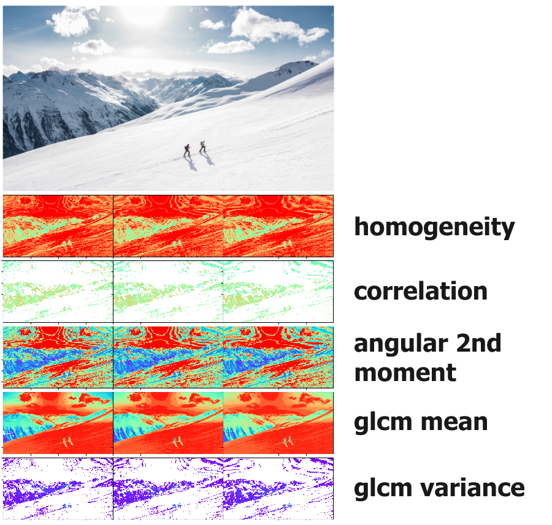

# Binned Cython 5 Feature GLCM



[**Photo by Flo Maderebner from Pexels**](https://www.pexels.com/@fmaderebner)

800 Times faster, the above image takes 5.7 Days to process, compared to 9.8 Minutes with `glcmbin5`

*Performance will vary with devices*

```
pip install glcmbin5
```

## Motivation

There are 2 main improvements, speed and memory size

### Speed

This is >800 times faster than using ``skimage.feature.graycomatrix`` and ``graycoprops``
because this is Cython optimized.

With a *2000x1000x3* image, it takes around 2 minutes.
Compared to a **33 hours** with ``skimage``

```
GLCM Progress: 100%|██████████| 12/12 [02:27<00:00, 12.30s/it]
```

### Memory Size

If you don't *bin* the array before calculating GLCM, you'll end up with an extremely
large GLCM.

With this algorithm, I omit generating the whole GLCM, instead, it's integrated in
the GLCM feature calculation. Memory used is freed asap.

Plus, decreasing the GLCM size improves performance significantly.

## Example

You can also see an example in [`/examples`](https://github.com/Eve-ning/glcm/tree/master/examples)

```python
from glcm.glcm import CyGLCM
import numpy as np
ar = ...
glcm = CyGLCM(ar.astype(np.float32),
              radius=3,
              bins=8,
              pairs=('H', 'V', 'SE', 'NE')
              ).create_glcm()
```

## Arguments

- **radius**: The radius of the GLCM window
- **bins**: The number of bins to use
- **pairs**:
  - **H**: Horizontal Pair
  - **V**: Vertical Pair
  - **SE**: South-East Diagonal Pair
  - **NE**: North-East Diagonal Pair

## I/O

**Input**:
- `ndim = 3`
- `shape=(in_dim0, in_dim1, channel)`

**Output**:
- `ndim = 4`
- `shape=(in_dim0, in_dim1, channel, features)`
- Methods:
  - Contrast 
  - Correlation
  - Angular Second Moment
  - GLCM Mean
  - GLCM Variance

## Progress Bar

The progress bar value is the current pair calculated.

## Gotchas

### GLCM Shrink

The resulting GLCM array will be smaller than the original.

*GLCM Dimension = Dimension - (2 * radius + 1) = Dimension - Diameter*

The + 1 comes from the pairing.

### Data Type `float32`

Arrays **MUST BE** in ``np.float32``, you need to cast it.
```
ar.astype(np.float32)
```

## Features

Based on [GLCM Texture: A Tutorial v. 3.0 March 2017](https://prism.ucalgary.ca/handle/1880/51900).

For an effective segmentation, we just need 5 features as selected here.

Many features are not significantly orthogonal, hence more will introduce redundancy.

Chosen methods are for simplicity and efficiency in coding. 

## Binning

Arrays are **Binned** before going through GLCM.

All arrays will be processed to integer values `[0,bin-1]` band-independently.

# Custom Cython Build

Run this command with the `c_setup.py` here
```
python c_setup.py build_ext --inplace
```

# What's the magic?

There are several optimizations

1) It's written mainly in Cython (with little required Python calls)
2) Binning before running the GLCM decreases required GLCM calls

# Citation

If you have used or referenced any of the code in the repository,
please kindly cite

```
@misc{glcmbin5,
  author = {John Chang},
  title = {Binned Cython 5 Feature GLCM},
  year = {2021},
  publisher = {GitHub},
  journal = {GitHub Repository},
  howpublished = {\url{https://github.com/Eve-ning/glcm}},
}
```

# Acknowledgements

- [Dr. Ji-Jon Sit](https://dr.ntu.edu.sg/cris/rp/rp00175) for hosting the parent project [`Eve-ning/FRModel`](https://github.com/Eve-ning/FRModel) which lead to this algorithm
- [Wang Ji Fei](https://fass.nus.edu.sg/geog/people/wang-jifei/) for discovering GLCM Binning optimization.
- [GLCM Texture: A Tutorial v. 3.0 March 2017](https://prism.ucalgary.ca/handle/1880/51900) for providing a
simple tutorial to guide this implementation.


# Annex

## Speed Benchmark with `skimage.feature.greycomatrix`

```python

import time

import PIL.Image
import numpy as np
from matplotlib import pyplot as plt
from skimage.feature import greycomatrix, greycoprops
#%%

image = np.asarray(PIL.Image.open("sample.jpg"))[::2,::2,0]

s = time.time()
for i in range(10000):
    glcm = greycomatrix(np.random.randint(0, 192, [5, 5]).astype(np.uint8), [1], [0])
    g = greycoprops(glcm, 'contrast')
    g = greycoprops(glcm, 'dissimilarity')
    g = greycoprops(glcm, 'energy')
    g = greycoprops(glcm, 'ASM')
    g = greycoprops(glcm, 'correlation')

e = time.time()

# / 10000 for each window
# 1116 * 1991 because the image has that many windows
# 3 for 3 channels
# /147 for 2m27s of my current timing
# ~ 832.0464063705289
print(((e-s) * 8 / 10000 * 1116 * 1991 * 3)/147)
```
